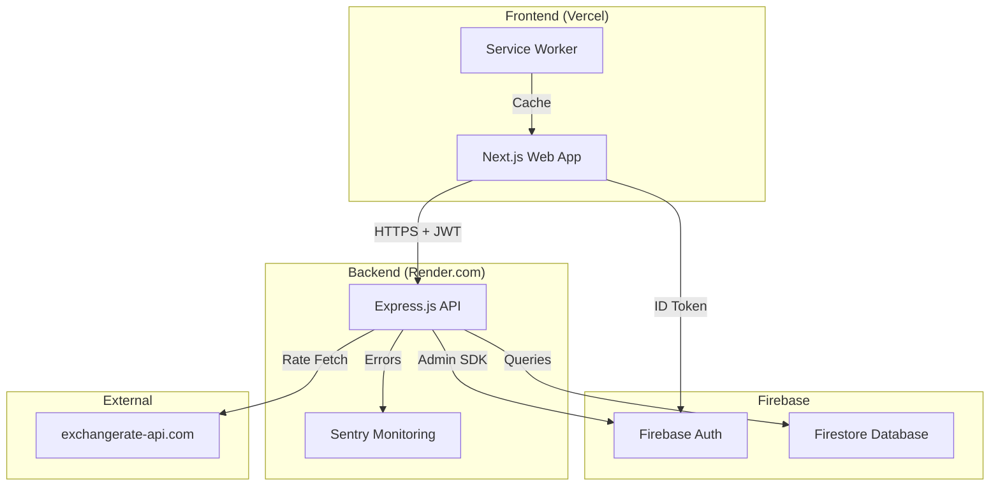
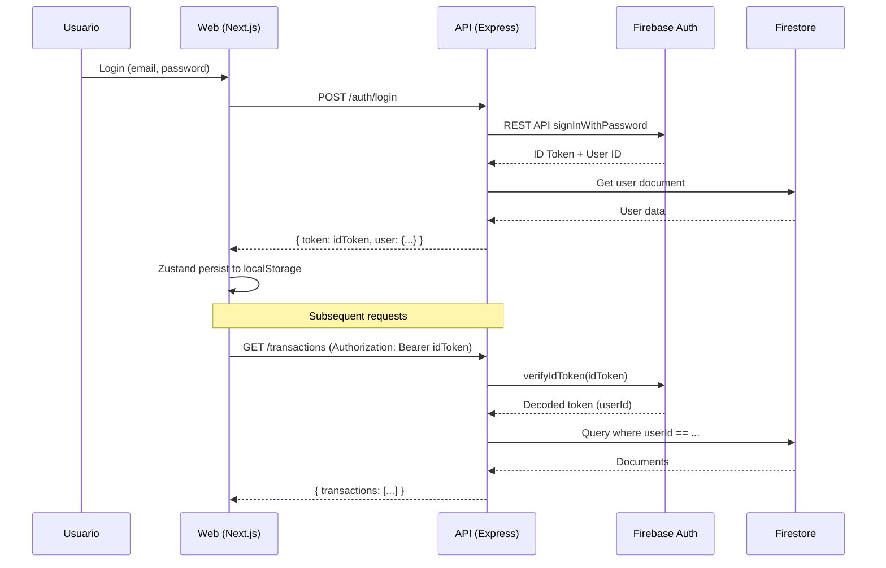

# PROJECT_MASTER_BIBLE.md
## Aplicación de Finanzas Personales - Documentación Maestra

**Última actualización:** Noviembre 2024  
**Versión:** 2.0.0  
**Estado:** En Producción (Migrado a Firebase)

---

## ÍNDICE

1. [Resumen Ejecutivo](#1-resumen-ejecutivo)
2. [Árbol de Directorios](#2-árbol-de-directorios-anotado)
3. [Arquitectura y Flujo de Datos](#3-arquitectura-y-flujo-de-datos)
4. [Diccionario de Componentes](#4-diccionario-de-componentes-y-lógica)
5. [Reglas de Negocio](#5-reglas-de-negocio-y-lógica-crítica)
6. [Estado del Desarrollo](#6-estado-del-desarrollo-snapshot)
7. [Historial de Migración](#7-historial-de-migración-y-evolución)
8. [Auditorías y Correcciones](#8-auditorías-realizadas-y-correcciones-aplicadas)
9. [Guía de Instalación](#9-guía-de-instalación-y-despliegue)
10. [Instrucciones para la Siguiente IA](#10-instrucciones-para-la-siguiente-ia)

---

## 1. RESUMEN EJECUTIVO

### 1.1 ¿Qué es este proyecto?
Aplicación web/móvil de **finanzas personales** que permite a usuarios gestionar ingresos, gastos, presupuestos, metas de ahorro y deudas. Incluye conversión de monedas USD/UYU, transacciones recurrentes, estadísticas visuales y exportación de datos.

### 1.2 Problema que resuelve
- Control de gastos diarios con presupuesto dinámico (rollover)
- Seguimiento de metas de ahorro mensuales
- Gestión de deudas en cuotas
- Visualización de tendencias financieras
- Soporte multi-moneda (USD/UYU)

### 1.3 Stack Tecnológico Completo

| Capa | Tecnología | Versión |
|------|------------|---------|
| **Frontend Web** | Next.js (App Router) | 14.2.5 |
| **UI Framework** | React | 18.2.0 |
| **State Management** | Zustand | 4.5.0 |
| **Forms** | react-hook-form | 7.66.1 |
| **Charts** | Recharts | 3.4.1 |
| **HTTP Client** | Axios | 1.6.8 |
| **Backend** | Express.js | 4.19.2 |
| **Runtime** | Node.js | 20.x |
| **Database** | Firebase Firestore | - |
| **Auth** | Firebase Auth | 12.0.0 |
| **Validation** | Zod | 3.23.8 |
| **Monitoring** | Sentry | 10.27.0 |
| **Logging** | Pino | 9.0.0 |
| **Mobile** | Expo/React Native | - |
| **Testing** | Vitest | 2.1.1 |
| **Language** | TypeScript | 5.6.3 |

### 1.4 URLs de Producción
- **Frontend:** https://web-tau-one-16.vercel.app/
- **Backend API:** https://finanzas-api-homa.onrender.com
- **API Docs:** https://finanzas-api-homa.onrender.com/docs

---

## 2. ÁRBOL DE DIRECTORIOS ANOTADO

```
PROYECTO_APP_FINANZA/
├── apps/
│   ├── api/                          # Backend Express.js
│   │   ├── src/
│   │   │   ├── controllers/          # Lógica de negocio por entidad
│   │   │   │   ├── auth.controller.ts        # Registro, login, reset password
│   │   │   │   ├── accounts.controller.ts    # CRUD cuentas bancarias
│   │   │   │   ├── categories.controller.ts  # CRUD categorías jerárquicas
│   │   │   │   ├── transactions.controller.ts # CRUD transacciones
│   │   │   │   ├── budget.controller.ts      # Cálculo presupuesto diario
│   │   │   │   ├── budgets.controller.ts     # Presupuestos por categoría
│   │   │   │   ├── goals.controller.ts       # Metas de ahorro mensuales
│   │   │   │   ├── debts.controller.ts       # Gestión de deudas
│   │   │   │   ├── statistics.controller.ts  # Agregaciones y reportes
│   │   │   │   ├── export.controller.ts      # Exportación CSV
│   │   │   │   ├── exchange.controller.ts    # Tipo de cambio USD/UYU
│   │   │   │   ├── search.controller.ts      # Búsqueda global
│   │   │   │   ├── patterns.controller.ts    # Detección de patrones
│   │   │   │   ├── notifications.controller.ts # Push notifications
│   │   │   │   ├── tags.controller.ts        # Etiquetas de transacciones
│   │   │   │   ├── alerts.controller.ts      # Alertas de presupuesto
│   │   │   │   └── reports.controller.ts     # Reportes financieros
│   │   │   ├── routes/               # Definición de endpoints REST
│   │   │   │   └── [17 archivos .routes.ts]
│   │   │   ├── services/             # Lógica de negocio reutilizable
│   │   │   │   ├── budget.service.ts         # Cálculo rollover presupuesto
│   │   │   │   ├── exchange.service.ts       # Cache y API tipo de cambio
│   │   │   │   └── email.service.ts          # Envío de emails
│   │   │   ├── lib/                  # Utilidades core
│   │   │   │   ├── firebase.ts               # Inicialización Firebase Admin
│   │   │   │   ├── firestore-helpers.ts      # Queries, paginación, batch
│   │   │   │   ├── monitoring.ts             # Sentry, Pino, métricas
│   │   │   │   └── time.ts                   # Utilidades de fechas/TZ
│   │   │   ├── server/
│   │   │   │   ├── app.ts                    # Configuración Express
│   │   │   │   └── middleware/
│   │   │   │       ├── auth.ts               # Verificación JWT Firebase
│   │   │   │       ├── validate.ts           # Validación Zod
│   │   │   │       └── error.ts              # Manejo centralizado errores
│   │   │   ├── swagger/
│   │   │   │   └── openapi.ts                # Documentación OpenAPI
│   │   │   ├── tests/
│   │   │   │   ├── setup.ts                  # Mock Firebase para tests
│   │   │   │   └── helpers.ts                # Utilidades de testing
│   │   │   └── index.ts              # Entry point del servidor
│   │   ├── Dockerfile                # Imagen Docker para Render
│   │   ├── render.yaml               # Configuración Render.com
│   │   ├── firebase.json             # Configuración Firebase CLI
│   │   ├── firestore.indexes.json    # Índices compuestos Firestore
│   │   ├── firestore.rules           # Reglas de seguridad Firestore
│   │   ├── vitest.config.ts          # Configuración tests
│   │   └── package.json
│   │
│   ├── web/                          # Frontend Next.js
│   │   ├── app/                      # App Router (Next.js 14)
│   │   │   ├── layout.tsx            # Layout raíz con providers
│   │   │   ├── providers.tsx         # Context providers (Toast, Auth)
│   │   │   ├── globals.css           # Estilos globales
│   │   │   ├── page.tsx              # Landing page (redirect)
│   │   │   ├── login/page.tsx        # Página de login
│   │   │   ├── signup/page.tsx       # Página de registro
│   │   │   ├── forgot-password/      # Recuperación de contraseña
│   │   │   ├── reset-password/       # Reset de contraseña
│   │   │   ├── dashboard/page.tsx    # Dashboard principal (1295 líneas)
│   │   │   ├── transactions/
│   │   │   │   ├── page.tsx          # Lista de transacciones
│   │   │   │   └── new/page.tsx      # Crear transacción
│   │   │   ├── accounts/page.tsx     # Gestión de cuentas
│   │   │   ├── categories/page.tsx   # Gestión de categorías
│   │   │   ├── savings/page.tsx      # Metas de ahorro
│   │   │   ├── debts/page.tsx        # Gestión de deudas
│   │   │   ├── statistics/page.tsx   # Estadísticas y gráficos
│   │   │   ├── recurring/page.tsx    # Transacciones recurrentes
│   │   │   ├── tags/page.tsx         # Gestión de etiquetas
│   │   │   └── patterns/page.tsx     # Patrones de gasto
│   │   ├── components/
│   │   │   ├── GlobalSearch.tsx      # Búsqueda global (Ctrl+K)
│   │   │   ├── NotificationManager.tsx # Push notifications
│   │   │   └── ui/                   # Componentes reutilizables
│   │   │       ├── Spinner.tsx
│   │   │       ├── Toast.tsx
│   │   │       ├── ConfirmModal.tsx
│   │   │       ├── Skeleton.tsx
│   │   │       ├── Button.tsx
│   │   │       ├── Form.tsx          # useZodForm, FormInput
│   │   │       └── index.ts
│   │   ├── lib/
│   │   │   ├── api.ts                # Cliente Axios configurado
│   │   │   ├── schemas.ts            # Schemas Zod frontend
│   │   │   └── offlineQueue.ts       # Cola offline (WIP)
│   │   ├── store/
│   │   │   └── auth.ts               # Zustand store con persistencia
│   │   ├── public/
│   │   │   ├── manifest.json         # PWA manifest
│   │   │   └── sw.js                 # Service Worker
│   │   ├── vercel.json               # Configuración Vercel
│   │   └── package.json
│   │
│   └── mobile/                       # App móvil Expo (básica)
│       ├── App.tsx
│       └── package.json
│
├── packages/
│   └── shared/                       # Código compartido
│       └── src/
│           ├── schemas.ts            # Schemas Zod compartidos
│           └── index.ts              # Re-exports
│
├── docs/                             # Documentación
│   ├── ADR/                          # Architecture Decision Records
│   │   ├── 0001-stack.md
│   │   └── 0002-centavos.md          # Por qué usamos centavos
│   ├── API.md
│   └── SECURITY.md
│
├── infra/
│   └── docker-compose.yml            # Docker local (legacy)
│
├── scripts/
│   ├── deploy-railway.sh
│   └── setup-env.sh
│
└── package.json                      # Monorepo workspaces
```

---

## 3. ARQUITECTURA Y FLUJO DE DATOS

### 3.1 Diagrama de Arquitectura



### 3.2 Flujo de Autenticación



### 3.3 Flujo de Datos - Transacción

```mermaid
flowchart LR
    subgraph Input
        FORM[Formulario]
    end
    
    subgraph Validation
        ZOD[Zod Schema]
    end
    
    subgraph API
        CTRL[Controller]
        SVC[Service]
    end
    
    subgraph Database
        FS[(Firestore)]
    end
    
    FORM -->|amountCents, categoryId, ...| ZOD
    ZOD -->|Validated data| CTRL
    CTRL -->|Verify ownership| FS
    CTRL -->|Create doc| FS
    FS -->|Batch write| FS
    
    Note over CTRL: Si es gasto de deuda,<br/>actualiza paidInstallments<br/>atómicamente
```

### 3.4 Endpoints API Principales

| Método | Endpoint | Descripción | Auth |
|--------|----------|-------------|------|
| POST | `/auth/register` | Registro de usuario | No |
| POST | `/auth/login` | Login (retorna ID token) | No |
| GET | `/auth/me` | Perfil del usuario | Sí |
| GET | `/accounts` | Listar cuentas del usuario | Sí |
| POST | `/accounts` | Crear cuenta | Sí |
| GET | `/categories` | Listar categorías | Sí |
| POST | `/categories` | Crear categoría | Sí |
| GET | `/transactions` | Listar transacciones (paginado) | Sí |
| POST | `/transactions` | Crear transacción | Sí |
| GET | `/budget/summary` | Resumen presupuesto diario | Sí |
| GET | `/goals` | Meta de ahorro del mes | Sí |
| POST | `/goals` | Crear/actualizar meta | Sí |
| GET | `/statistics/expenses-by-category` | Gastos agrupados | Sí |
| GET | `/exchange/rate` | Tipo de cambio USD/UYU | Sí |
| GET | `/debts` | Listar deudas | Sí |
| POST | `/debts` | Crear deuda | Sí |
| GET | `/export/csv` | Exportar transacciones | Sí |

### 3.5 Colecciones Firestore

```
users/{userId}
  - email: string
  - name: string | null
  - currencyCode: "USD" | "UYU"
  - locale: string
  - timeZone: string
  - createdAt: Timestamp

accounts/{accountId}
  - userId: string
  - name: string
  - type: "CASH" | "BANK" | "CREDIT" | "SAVINGS" | "OTHER"
  - currencyCode: string
  - createdAt: Timestamp

categories/{categoryId}
  - userId: string
  - name: string
  - type: "INCOME" | "EXPENSE"
  - parentId: string | null (para subcategorías)
  - icon: string | null
  - color: string | null
  - createdAt: Timestamp

transactions/{transactionId}
  - userId: string
  - accountId: string
  - categoryId: string
  - type: "INCOME" | "EXPENSE" | "TRANSFER"
  - amountCents: number (entero, sin decimales)
  - currencyCode: string
  - occurredAt: Timestamp
  - description: string | null
  - isRecurring: boolean
  - recurringRule: string | null (JSON)
  - nextOccurrence: Timestamp | null
  - isPaid: boolean
  - totalOccurrences: number | null
  - remainingOccurrences: number | null
  - createdAt: Timestamp

monthlyGoals/{goalId}
  - userId: string
  - month: Timestamp (primer día del mes)
  - savingGoalCents: number
  - createdAt: Timestamp

debts/{debtId}
  - userId: string
  - description: string
  - totalAmountCents: number
  - currencyCode: string
  - totalInstallments: number
  - paidInstallments: number
  - monthlyPaymentCents: number
  - interestRate: number | null
  - startDate: Timestamp
  - createdAt: Timestamp

categoryBudgets/{budgetId}
  - userId: string
  - categoryId: string
  - month: Timestamp
  - budgetCents: number
  - alertThreshold: number (0-100)
  - createdAt: Timestamp

tags/{tagId}
  - userId: string
  - name: string
  - color: string

transactionTags/{id}
  - transactionId: string
  - tagId: string

_cache/exchange_rates (sistema)
  - USD_UYU: number
  - timestamp: Timestamp
  - source: string
```

---

## 4. DICCIONARIO DE COMPONENTES Y LÓGICA

### 4.1 Variables de Entorno

#### Backend (`apps/api/.env`)
```env
# Puerto del servidor
PORT=4000

# Firebase Admin SDK (elegir UNA opción)
FIREBASE_SERVICE_ACCOUNT=<JSON string o Base64>
# O
FIREBASE_SERVICE_ACCOUNT_PATH=./firebase-service-account.json
# O
GOOGLE_APPLICATION_CREDENTIALS=/path/to/credentials.json

# Firebase Web API Key (para verificar contraseñas)
FIREBASE_API_KEY=AIzaSy...

# CORS
CORS_ORIGIN=https://web-tau-one-16.vercel.app

# Entorno
NODE_ENV=production

# Sentry (opcional)
SENTRY_DSN=https://...@sentry.io/...

# Email (opcional)
SMTP_HOST=smtp.gmail.com
SMTP_PORT=587
SMTP_USER=...
SMTP_PASS=...

# Tipo de cambio fallback
DEFAULT_USD_UYU_RATE=40.0
```

#### Frontend (`apps/web/.env.local`)
```env
NEXT_PUBLIC_API_URL=https://finanzas-api-homa.onrender.com
```

### 4.2 State Management (Zustand)

```typescript
// apps/web/store/auth.ts
type State = {
  user?: User;
  token?: string;
  initialized: boolean;
  login: (email: string, password: string) => Promise<void>;
  logout: () => void;
  register: (payload: any) => Promise<void>;
  initAuth: () => void;
};

// Persistencia automática en localStorage
// Rehydration al cargar la app
```

### 4.3 Schemas de Validación (Zod)

```typescript
// packages/shared/src/schemas.ts

// Transacción
TransactionSchema = z.object({
  accountId: z.string().cuid(),
  categoryId: z.string().cuid(),
  type: z.enum(["INCOME", "EXPENSE", "TRANSFER"]),
  amountCents: z.number().int().positive(), // CENTAVOS, entero
  currencyCode: z.string().min(3).max(3),
  occurredAt: z.string(), // ISO string
  description: z.string().nullable().optional(),
  isRecurring: z.boolean().optional().default(false),
  // ... más campos para recurrentes
});

// Categoría
CategorySchema = z.object({
  name: z.string().min(1),
  type: z.enum(["INCOME", "EXPENSE"]),
  parentId: z.string().cuid().nullable().optional(), // Jerarquía
  icon: z.string().nullable().optional(),
  color: z.string().nullable().optional(),
});
```

### 4.4 Helpers Firestore Críticos

```typescript
// apps/api/src/lib/firestore-helpers.ts

// Obtener documentos por IDs (respeta límite de 10)
async function getDocumentsByIds<T>(collection: string, ids: string[]): Promise<T[]> {
  const chunks = chunkArray(uniqueIds, 10); // Firestore limit
  const results = await Promise.all(
    chunks.map(chunk =>
      db.collection(collection)
        .where(FieldPath.documentId(), "in", chunk)
        .get()
    )
  );
  return results.flatMap(s => s.docs).map(doc => docToObject(doc));
}

// Convertir Timestamps a Date y viceversa
function docToObject(doc): any { /* ... */ }
function objectToFirestore(obj): any { /* ... */ }
```

### 4.5 Servicio de Presupuesto

```typescript
// apps/api/src/services/budget.service.ts

// Cálculo del presupuesto diario con rollover
function computeDailyBudgetWithRollover(params) {
  // availableStartCents = ingresos - metaAhorro - gastosPrevios
  // dailyTargetCents = availableStartCents / díasRestantes
  // rollover = lo que sobró de ayer se suma a mañana
  return {
    startOfDay: { availableCents, dailyTargetCents },
    endOfDay: { availableCents, dailyTargetTomorrowCents, rolloverFromTodayCents },
    safety: { overspend, overspendCents }
  };
}
```

### 4.6 Servicio de Tipo de Cambio

```typescript
// apps/api/src/services/exchange.service.ts

// Prioridad de caché:
// 1. Memoria (6 horas)
// 2. Firestore (24 horas)
// 3. API externa (exchangerate-api.com)
// 4. Valor por defecto (40.0)

async function getUSDToUYUExchangeRate(): Promise<number> { /* ... */ }
async function safeConvertCurrency(amount, from, to): Promise<number> { /* ... */ }
```

---

## 5. REGLAS DE NEGOCIO Y LÓGICA CRÍTICA

### 5.1 ¿Por qué centavos?
**ADR-0002:** Todos los montos se almacenan como **enteros en centavos** para evitar errores de punto flotante. Un gasto de $100.50 se guarda como `10050`.

### 5.2 Categorías Jerárquicas
- Las categorías pueden tener `parentId` para crear subcategorías
- Máximo 10 niveles de profundidad (protección contra loops)
- Si se elimina una categoría padre, las hijas quedan huérfanas

### 5.3 Transacciones Recurrentes
- `isRecurring: true` marca la transacción como plantilla
- `recurringRule` contiene JSON con frecuencia (daily/weekly/monthly)
- `nextOccurrence` indica cuándo mostrar el recordatorio
- `isPaid: true` cuando el usuario confirma el pago
- `remainingOccurrences` cuenta regresiva (null = indefinido)

### 5.4 Integración Deudas-Transacciones
Cuando se crea un gasto en una subcategoría de "Deudas":
1. Se busca la deuda correspondiente por nombre
2. Se incrementa `paidInstallments` atómicamente
3. Todo en un batch write para consistencia

### 5.5 Conversión de Monedas
- El usuario tiene una `currencyCode` base (USD o UYU)
- Todas las transacciones se convierten a la moneda base para totales
- El tipo de cambio se cachea para evitar llamadas excesivas

### 5.6 Autenticación Firebase
- **Registro/Login:** Usa Firebase Auth REST API para verificar contraseña
- **Token:** Devuelve ID Token (no Custom Token)
- **Middleware:** `verifyIdToken()` en cada request autenticado
- **Persistencia:** Zustand + localStorage en frontend

---

## 6. ESTADO DEL DESARROLLO (SNAPSHOT)

### ✅ Funcionalidades Completadas

| Feature | Estado | Notas |
|---------|--------|-------|
| Registro/Login | ✅ Completo | Firebase Auth + ID Token |
| Gestión de Cuentas | ✅ Completo | CRUD, tipos (CASH, BANK, etc) |
| Gestión de Categorías | ✅ Completo | Jerárquicas, con iconos |
| Transacciones CRUD | ✅ Completo | Filtros, paginación |
| Transacciones Recurrentes | ✅ Completo | Recordatorios, ocurrencias |
| Presupuesto Diario | ✅ Completo | Rollover, meta de ahorro |
| Metas de Ahorro | ✅ Completo | Por mes, progreso visual |
| Gestión de Deudas | ✅ Completo | Cuotas, integración con gastos |
| Estadísticas | ✅ Completo | Gráficos Recharts |
| Conversión USD/UYU | ✅ Completo | Cache en memoria + Firestore |
| Búsqueda Global | ✅ Completo | Ctrl+K |
| Exportación CSV | ✅ Completo | Por rango de fechas |
| PWA Básica | ✅ Completo | manifest.json, sw.js |
| Deploy Backend | ✅ Completo | Render.com |
| Deploy Frontend | ✅ Completo | Vercel |
| Rate Limiting | ✅ Completo | General + Auth |
| Monitoring | ✅ Completo | Sentry + Pino |
| Persistencia Sesión | ✅ Completo | Zustand persist |

### 🚧 En Progreso (WIP)

| Feature | Estado | Notas |
|---------|--------|-------|
| App Móvil | 🚧 Básico | Solo estructura Expo |
| Offline Queue | 🚧 Estructura | offlineQueue.ts existe pero no integrado |
| Push Notifications | 🚧 Parcial | UI existe, backend básico |
| Presupuestos por Categoría | 🚧 Backend listo | UI incompleta |

### ❌ Deuda Técnica / Bugs Conocidos

| Issue | Severidad | Descripción | Estado |
|-------|-----------|-------------|--------|
| Tests Firebase | Media | Tests que requieren Firebase real fueron eliminados | Pendiente |
| Índices Firestore | Baja | Algunos queries complejos pueden requerir índices adicionales | Pendiente |
| Mobile App | Media | Prácticamente sin desarrollar | Pendiente |
| Email Service | Baja | Configuración SMTP no testeada en prod | Pendiente |
| ~~Sesión perdida en navegación~~ | ~~Crítico~~ | ~~Token no persistía correctamente entre páginas~~ | ✅ CORREGIDO (Nov 2025) |

### 🔧 Bug Crítico Corregido (Nov 2025): Pérdida de Sesión

**Problema:** Al navegar directamente a una URL (ej: `/categories`), la sesión se perdía y el usuario era redirigido a `/login`.

**Causa Raíz:** 
- Zustand persist guardaba el token bajo `auth-storage` como JSON
- Las páginas buscaban `localStorage.getItem("token")` que no existía
- La rehidratación de Zustand ocurría después del check de auth en useEffect

**Solución Aplicada:**
- Modificadas 12 páginas para usar `token` del store de Zustand
- Agregado check de `initialized` para esperar rehidratación
- Patrón corregido:
```typescript
const { user, token, initialized, initAuth } = useAuth();

useEffect(() => {
  if (!initialized) {
    initAuth();
    return;
  }
  if (!user || !token) {
    router.push("/login");
    return;
  }
  setAuthToken(token);
  // ... cargar datos
}, [user, token, initialized, ...]);
```

**Archivos Modificados:**
- `apps/web/app/dashboard/page.tsx`
- `apps/web/app/accounts/page.tsx`
- `apps/web/app/categories/page.tsx`
- `apps/web/app/transactions/page.tsx`
- `apps/web/app/transactions/new/page.tsx`
- `apps/web/app/savings/page.tsx`
- `apps/web/app/debts/page.tsx`
- `apps/web/app/recurring/page.tsx`
- `apps/web/app/statistics/page.tsx`
- `apps/web/app/tags/page.tsx`
- `apps/web/app/patterns/page.tsx`
- `apps/web/components/GlobalSearch.tsx`
- `apps/web/components/NotificationManager.tsx`

### 9.1 Desarrollo Local

```bash
# 1. Clonar repositorio
git clone <repo-url>
cd PROYECTO_APP_FINANZA

# 2. Instalar dependencias (desde raíz)
npm install

# 3. Configurar Firebase
# - Crear proyecto en Firebase Console
# - Habilitar Authentication (Email/Password)
# - Crear Firestore database
# - Descargar Service Account JSON

# 4. Configurar variables de entorno
# Backend
cp apps/api/.env.example apps/api/.env
# Editar con tus credenciales Firebase

# Frontend
echo "NEXT_PUBLIC_API_URL=http://localhost:4000" > apps/web/.env.local

# 5. Iniciar backend
cd apps/api
npm run dev
# Servidor en http://localhost:4000

# 6. Iniciar frontend (otra terminal)
cd apps/web
npm run dev
# App en http://localhost:3000

# 7. (Opcional) Desplegar índices Firestore
cd apps/api
npx firebase deploy --only firestore:indexes
```

### 9.2 Deploy a Producción

#### Backend (Render.com)
1. Conectar repositorio a Render
2. Crear Web Service
3. Configurar:
   - Build Command: `cd apps/api && npm install && npm run build`
   - Start Command: `cd apps/api && npm start`
   - Environment Variables:
     - `FIREBASE_SERVICE_ACCOUNT` (Base64 del JSON)
     - `FIREBASE_API_KEY`
     - `CORS_ORIGIN=https://tu-app.vercel.app`
     - `NODE_ENV=production`

#### Frontend (Vercel)
1. Importar proyecto en Vercel
2. Root Directory: `apps/web`
3. Environment Variables:
   - `NEXT_PUBLIC_API_URL=https://tu-api.onrender.com`

### 9.3 Comandos Útiles

```bash
# Tests
cd apps/api && npm test

# Build
npm run build --workspaces

# Lint
npm run lint --workspaces

# Deploy Firestore indexes
cd apps/api && npx firebase deploy --only firestore:indexes
```

---

## 7. HISTORIAL DE MIGRACIÓN Y EVOLUCIÓN

### 7.1 Migración de Prisma/PostgreSQL a Firebase (Completada)

**Fecha:** Noviembre 2024  
**Documentación original:** `ANALISIS_MIGRACION_FIREBASE.md`, `MIGRACION_COMPLETA.md`

#### Stack Original (Deprecado)
- **ORM:** Prisma
- **Database:** PostgreSQL (Docker local o Railway)
- **Auth:** JWT + Argon2 (custom)
- **Hosting:** Railway ($5 gratis)

#### Stack Actual (Firebase)
- **Database:** Firestore
- **Auth:** Firebase Authentication
- **Hosting:** Render.com (backend) + Vercel (frontend)
- **Costo:** $0/mes (free tier)

#### Razones de la Migración
1. **Costo:** Firebase free tier es más generoso que Railway
2. **Escalabilidad:** Firestore escala automáticamente
3. **Simplicidad:** Un solo proveedor para auth + database
4. **Real-time:** Posibilidad de listeners en tiempo real (futuro)

#### Archivos Migrados (17 controladores)
- `auth.controller.ts` - De JWT a Firebase Auth
- `accounts.controller.ts` - De Prisma a Firestore
- `categories.controller.ts` - Con validación de ciclos
- `transactions.controller.ts` - Con batch writes
- `goals.controller.ts` - Meta mensual
- `budgets.controller.ts` - Presupuesto por categoría
- `tags.controller.ts` - Etiquetas
- `patterns.controller.ts` - Detección de patrones
- `search.controller.ts` - Búsqueda global
- `statistics.controller.ts` - Optimizado N+1
- `debts.controller.ts` - Con operaciones atómicas
- `notifications.controller.ts` - Push notifications
- `alerts.controller.ts` - Alertas de presupuesto
- `budget.controller.ts` - Cálculo diario
- `reports.controller.ts` - Reportes
- `export.controller.ts` - Exportación CSV
- `exchange.controller.ts` - Tipo de cambio

### 7.2 Funcionalidades Implementadas Post-Migración

**Documentación:** `IMPLEMENTACION_COMPLETADA.md`

1. **Búsqueda Global Inteligente**
   - Endpoint `/search` con autocompletado
   - Atajo `Ctrl+K` / `Cmd+K`
   - Búsqueda en transacciones, categorías, cuentas, tags
   - Debounce 300ms

2. **Gráficos Interactivos (Recharts)**
   - Líneas: Tendencias últimos 6 meses
   - Barras: Comparación ingresos vs gastos
   - Pie: Distribución por categoría
   - Tooltips interactivos

3. **Recordatorios y Notificaciones**
   - Service Worker (`sw.js`)
   - Notificaciones de transacciones recurrentes
   - Alertas de presupuesto (80%, 90%, 100%)
   - Progreso de metas de ahorro

---

## 8. AUDITORÍAS REALIZADAS Y CORRECCIONES APLICADAS

### 8.1 Auditorías de Código

**Documentos fuente:**
- `AUDITORIA_COMPLETA.md`
- `AUDITORIA_INTEGRAL.md`
- `AUDITORIA_CONSOLIDADA.md`
- `ANALISIS_COMPARATIVO_AUDITORIAS.md`

### 8.2 Problemas Críticos Resueltos

| # | Problema | Archivo | Solución | Estado |
|---|----------|---------|----------|--------|
| 1 | Login no verificaba contraseña | `auth.controller.ts` | Usar Firebase Auth REST API | ✅ |
| 2 | Queries `__name__` inválidos | 8 controladores | Usar `FieldPath.documentId()` + chunking | ✅ |
| 3 | Falta validación variables entorno | `firebase.ts` | Throw error si faltan credenciales | ✅ |
| 4 | Reglas Firestore incompletas | `firestore.rules` | Validación de tipos y rangos | ✅ |
| 5 | Conversión monedas sin validación | `exchange.service.ts` | `safeConvertCurrency()` con fallback | ✅ |
| 6 | Operaciones no atómicas | `transactions.controller.ts`, `debts.controller.ts` | Batch writes | ✅ |
| 7 | N+1 queries en estadísticas | `statistics.controller.ts` | Query única + procesamiento en memoria | ✅ |

### 8.3 Mejoras de Seguridad Aplicadas

| Mejora | Archivo | Descripción |
|--------|---------|-------------|
| Rate Limiting | `app.ts` | 100 req/15min general, 15 req/15min auth |
| Error Handler | `error.ts` | No expone stack traces en producción |
| Validación Zod | `validate.ts` | Middleware centralizado |
| Sanitización | `validate.ts` | `sanitizeString()` para XSS básico |
| Logging | `monitoring.ts` | Pino estructurado + Sentry |

### 8.4 Mejoras de Performance Aplicadas

| Mejora | Archivo | Impacto |
|--------|---------|---------|
| Cache tipo de cambio | `exchange.service.ts` | Memoria (6h) + Firestore (24h) |
| Batch queries | `firestore-helpers.ts` | `chunkArray()` para límite de 10 |
| Optimización estadísticas | `statistics.controller.ts` | De 36 queries a 3 |
| `getExchangeRatesMap()` | `exchange.service.ts` | Una llamada por moneda única |

### 8.5 Problemas Pendientes (Deuda Técnica)

| Problema | Severidad | Descripción | Solución Propuesta |
|----------|-----------|-------------|-------------------|
| Tests con Firebase real | Media | Tests eliminados por complejidad | Firebase Emulators |
| Paginación con offset | Baja | Costoso en Firestore | Cursor-based pagination |
| Búsqueda de texto | Baja | Trae todos y filtra en memoria | Algolia o prefijos indexados |
| Mobile app | Media | Solo estructura básica | Desarrollar con Expo |

---

## 9. GUÍA DE INSTALACIÓN Y DESPLIEGUE

### 9.1 Desarrollo Local

```bash
# 1. Clonar repositorio
git clone <repo-url>
cd PROYECTO_APP_FINANZA

# 2. Instalar dependencias (desde raíz)
npm install

# 3. Configurar Firebase
# - Crear proyecto en Firebase Console
# - Habilitar Authentication (Email/Password)
# - Crear Firestore database
# - Descargar Service Account JSON

# 4. Configurar variables de entorno
# Backend
cp apps/api/.env.example apps/api/.env
# Editar con tus credenciales Firebase

# Frontend
echo "NEXT_PUBLIC_API_URL=http://localhost:4000" > apps/web/.env.local

# 5. Iniciar backend
cd apps/api
npm run dev
# Servidor en http://localhost:4000

# 6. Iniciar frontend (otra terminal)
cd apps/web
npm run dev
# App en http://localhost:3000

# 7. (Opcional) Desplegar índices Firestore
cd apps/api
npx firebase deploy --only firestore:indexes
```

### 9.2 Deploy a Producción

**Documentación detallada:** `DEPLOYMENT_COMPLETO.md`, `GUIA_DEPLOYMENT_PASO_A_PASO.md`

#### Backend (Render.com)
1. Conectar repositorio a Render
2. Crear Web Service
3. Configurar:
   - Build Command: `cd apps/api && npm install && npm run build`
   - Start Command: `cd apps/api && npm start`
   - Environment Variables:
     - `FIREBASE_SERVICE_ACCOUNT` (Base64 del JSON)
     - `FIREBASE_API_KEY`
     - `CORS_ORIGIN=https://tu-app.vercel.app`
     - `NODE_ENV=production`

#### Frontend (Vercel)
1. Importar proyecto en Vercel
2. Root Directory: `apps/web`
3. Environment Variables:
   - `NEXT_PUBLIC_API_URL=https://tu-api.onrender.com`

### 9.3 Configuración Firebase (Crítico)

**Documentación:** `apps/api/CONFIGURACION_FIREBASE.md`, `apps/api/CONFIGURACION_FIREBASE_API_KEY.md`

#### Paso 1: Crear Proyecto Firebase
1. Ir a [Firebase Console](https://console.firebase.google.com/)
2. Crear nuevo proyecto
3. Habilitar **Authentication** → **Email/Password**
4. Crear **Firestore Database** (modo producción)

#### Paso 2: Obtener Credenciales
1. Project Settings → Service accounts
2. Generate new private key → Descargar JSON
3. Project Settings → General → Web API Key (copiar)

#### Paso 3: Configurar Variables de Entorno

**Opción A: JSON directo (desarrollo)**
```env
FIREBASE_SERVICE_ACCOUNT_PATH=./firebase-service-account.json
FIREBASE_API_KEY=AIzaSy...
```

**Opción B: Base64 (producción en Render)**
```bash
# Codificar JSON a Base64
cat firebase-service-account.json | base64 -w 0
# Pegar resultado en variable de entorno
FIREBASE_SERVICE_ACCOUNT=eyJ0eXBlIjoi...
```

#### Paso 4: Desplegar Reglas e Índices
```bash
cd apps/api
npx firebase login
npx firebase use --add  # Seleccionar proyecto
npx firebase deploy --only firestore:rules
npx firebase deploy --only firestore:indexes
```

### 9.4 Comandos Útiles

```bash
# Tests
cd apps/api && npm test

# Build
npm run build --workspaces

# Lint
npm run lint --workspaces

# Deploy Firestore indexes
cd apps/api && npx firebase deploy --only firestore:indexes
```

---

## 10. INSTRUCCIONES PARA LA "SIGUIENTE IA"

### 10.1 Contexto de Continuación

**Estado actual:** La aplicación está **desplegada y funcional** en producción. El usuario puede:
- Registrarse y loguearse
- Crear cuentas, categorías y transacciones
- Ver dashboard con estadísticas
- Gestionar deudas y metas de ahorro

**Último trabajo realizado:**
1. Arreglé el popup de notificaciones (agregué botón cerrar + persistencia)
2. Arreglé la recarga de cuentas/categorías al crear transacción (listener de `focus`)
3. Generé esta documentación maestra

### 10.2 Tareas Pendientes Inmediatas

Los tests de funcionalidad quedaron pendientes:
- [x] Crear cuenta bancaria
- [ ] Crear categorías de gastos/ingresos
- [ ] Crear transacción de ingreso
- [ ] Crear transacción de gasto
- [ ] Ver historial de transacciones
- [ ] Ver estadísticas y gráficos
- [ ] Gestionar metas de ahorro
- [ ] Gestionar deudas
- [ ] Transacciones recurrentes
- [ ] Búsqueda global (Ctrl+K)
- [ ] Exportar datos CSV
- [ ] Logout y persistencia de sesión

### 10.3 Áreas que Requieren Atención

1. **App Móvil:** Prácticamente sin desarrollar. Si el usuario lo pide, empezar desde `apps/mobile/`.

2. **Offline Support:** El archivo `offlineQueue.ts` existe pero no está integrado. Requiere:
   - Interceptor Axios para detectar offline
   - IndexedDB para persistir queue
   - Sincronización al volver online

3. **Push Notifications:** Backend tiene estructura, pero falta:
   - VAPID keys configuradas
   - Service Worker completo
   - Scheduling de notificaciones

4. **Tests:** La mayoría de tests fueron simplificados/eliminados porque requerían Firebase real. Considerar:
   - Firebase Emulators para tests locales
   - Mocks más completos

### 10.4 Archivos Clave para Entender el Sistema

| Archivo | Descripción |
|---------|-------------|
| `apps/api/src/server/app.ts` | Configuración Express, rutas, middlewares |
| `apps/api/src/controllers/auth.controller.ts` | Flujo de autenticación Firebase |
| `apps/api/src/services/budget.service.ts` | Lógica de presupuesto con rollover |
| `apps/api/src/lib/firebase.ts` | Inicialización Firebase Admin |
| `apps/api/src/lib/firestore-helpers.ts` | Utilidades de queries |
| `apps/web/store/auth.ts` | State management con persistencia |
| `apps/web/app/dashboard/page.tsx` | Dashboard principal (1295 líneas) |
| `packages/shared/src/schemas.ts` | Schemas Zod compartidos |

### 10.5 Documentos de Referencia

| Documento | Contenido |
|-----------|-----------|
| `PROJECT_BLUEPRINT.md` | Visión original, casos de uso, arquitectura inicial |
| `AUDITORIA_CONSOLIDADA.md` | Auditoría completa con problemas y soluciones |
| `PROGRESO_EJECUCION.md` | Correcciones críticas aplicadas |
| `RESUMEN_MEJORAS.md` | Mejoras de performance y seguridad |
| `MIGRACION_COMPLETA.md` | Detalles de migración a Firebase |
| `IMPLEMENTACION_COMPLETADA.md` | Funcionalidades nuevas (búsqueda, gráficos, notificaciones) |
| `docs/FUNCIONALIDADES_ADICIONALES.md` | 15 funcionalidades propuestas priorizadas |
| `docs/NUEVAS_FUNCIONALIDADES_PROPUESTAS.md` | 5 funcionalidades UX adicionales |

### 10.6 Advertencias Importantes

1. **NO** usar `auth.createCustomToken()` para login - el frontend espera ID Token
2. **SIEMPRE** usar centavos para montos (`amountCents`)
3. **SIEMPRE** verificar `userId` en queries para evitar acceso a datos de otros usuarios
4. Los índices de Firestore deben desplegarse manualmente con `firebase deploy --only firestore:indexes`
5. El tipo de cambio USD/UYU viene de `exchangerate-api.com` - tiene rate limit
6. La variable `FIREBASE_API_KEY` es **obligatoria** para que el login verifique contraseñas
7. Firestore limita queries `in` a 10 elementos - usar `chunkArray()` para más

### 10.7 Funcionalidades Futuras Propuestas (Priorizadas)

**Alta Prioridad:**
1. Presupuesto por Categoría con Alertas
2. Historial de Transacciones con Filtros Avanzados
3. Metas de Ahorro con Progreso Visual
4. Etiquetas/Tags para Transacciones
5. Reconocimiento Automático de Patrones

**Media Prioridad:**
6. Presupuesto Flexible por Período
7. Modo Oscuro
8. Fondo de Emergencia
9. Comparación de Períodos
10. Plantillas de Transacciones

**Futuro:**
11. Integración con Bancos (Open Banking)
12. Análisis Predictivo con ML
13. Colaboración Multi-usuario
14. Asistente Virtual con IA
15. Modo Offline Completo

---

**Fin del documento.**  
**Versión:** 2.0.0  
**Última actualización:** Noviembre 2024

